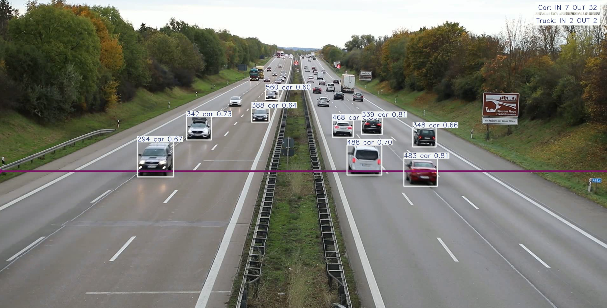

<html lang="en">
<head>
  <meta charset="utf-8" />
  <meta name="viewport" content="width=device-width,initial-scale=1" />
  <title>YOLO-based Object Counting & Tracking System</title>
  
</head>
<body>
  <h1>YOLO-Based Vehicle Counting and Tracking System</h1>

  <h2>Description</h2>
  

    This project uses YOLOv11 for object detection combined with multi-object tracking and line-based counting.
    It processes an input video, detects specified classes (e.g., people, cars, buses), tracks their trajectories across frames,
    and counts objects that cross a defined line (in/out).
  

  <h2>Features</h2>
  <ul>
    <li>Video object detection and multi-object tracking.</li>
    <li>Line-based entry / exit counting (simple analytics_type="line").</li>
    <li>Filter and count only specific classes (COCO class indices).</li>
    <li>Save processed output video (e.g. object_counting_output.avi).</li>
  </ul>

  <h2>Technologies</h2>
  <ul>
    <li>Python 3.9+</li>
    <li>OpenCV (opencv-python)</li>
    <li>Ultralytics YOLO package (ultralytics)</li>
    <li>BoTSORT / ByteTrack trackers (via tracker config files)</li>
  </ul>

  <h2>Usage</h2>
  <ol>
    <li>Install dependencies:
      <pre><code style=color:black;>pip install ultralytics opencv-python</code></pre>
    </li>
    <li><code>video_path = "object_tracking/data/sample_video.mp4" data/</code> change the path in the script.</li>
    <li>Adjust configuration inside the script (model path, classes, tracker, region points, device, confidence threshold).</li>
    <li>Run the main script:
      <pre><code style=color:black;>python main.py</code></pre>
    </li>
  </ol>

<h4> Classes to count (COCO indices) </h4>

classes = [2, 5, 7] # e.g., car, bus, truck

<h4> Tracker Config File</h4>

tracker = "botsort.yaml"

<h4> Line Region for Counting (x,y) Points </h4>

region = [(0, int(h/2)), (int(w), int(h/2))]
</code></pre>

  <h2>🎯 COCO Example Class Indices</h2>
  
Common COCO class indices you might use:

  <ul>
    <li>Person = <code>0</code></li>
    <li>Car = <code>2</code></li>
    <li>Bus = <code>5</code></li>
    <li>Truck = <code>7</code></li>
  </ul>

  <h2>📊 Output</h2>
  

    The program displays the processed frames with bounding boxes, tracking IDs and analytics (in/out counts).
    It also writes the resulting annotated video to <code>object_counting_output.avi</code>.
  

  <h2>⚙️ Notes & Tips</h2>
  <ul>
    <li>Ensure the YOLO model file (<code>.pt</code>) is available at the given path or use an official pretrained model name supported by Ultralytics.</li>
    <li>Set <code>device</code> to <code>0</code> for GPU (if available) or <code>"cpu"</code> for CPU.</li>
    <li>Tune <code>conf</code> (confidence threshold) and tracker settings for your scenario to balance detection sensitivity and false positives.</li>
    <li>For faster processing, consider using a smaller YOLO model (nano / small) or resize frames before inference.</li>
  </ul>
</body>
</html>
